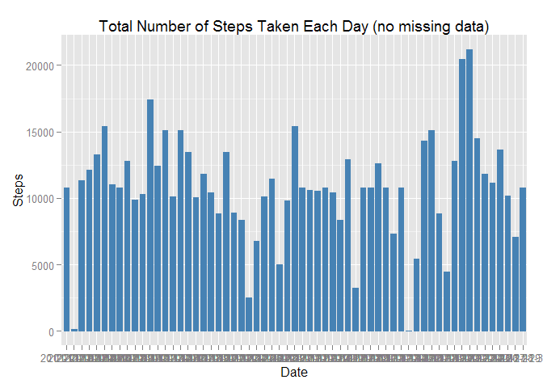

# Reproducible Research: Peer Assessment 1

## Loading and preprocessing the data


```r
unzip("./activity.zip") # contains activity.csv
actData <- read.csv("./activity.csv")
str(actData)
```

```
## 'data.frame':	17568 obs. of  3 variables:
##  $ steps   : int  NA NA NA NA NA NA NA NA NA NA ...
##  $ date    : Factor w/ 61 levels "2012-10-01","2012-10-02",..: 1 1 1 1 1 1 1 1 1 1 ...
##  $ interval: int  0 5 10 15 20 25 30 35 40 45 ...
```

## What is mean total number of steps taken per day?

1. Calculate the total number of steps taken per day


```r
library(ggplot2)
```

```
## Warning: package 'ggplot2' was built under R version 3.1.3
```

```r
dailySteps <- aggregate(actData[, 'steps'], FUN = sum, by = list(actData$date))
names(dailySteps)[1]<-paste("Date")
names(dailySteps)[2]<-paste("Steps")
```

2. Calculate and report the mean and median of the total number of steps taken per day


```r
meanDailySteps <- mean(dailySteps$Steps,na.rm = TRUE)
medianDailySteps <- median(dailySteps$Steps,na.rm = TRUE)

ggplot(data = dailySteps, aes(x = Steps)) + 
        ggtitle('Daily Number of Steps') + 
        ylab('Frequency') + 
        xlab('Number of Steps') + 
        geom_histogram(colour="black", fill="white")
```

```
## stat_bin: binwidth defaulted to range/30. Use 'binwidth = x' to adjust this.
```

 

The mean number of steps per day is 1.0766189\times 10^{4}
The median number of steps per day is 10765

## What is the average daily activity pattern?

Make a time series plot (i.e. type = "l") of the 5-minute interval (x-axis) and the average number of steps taken, averaged across all days (y-axis)


```r
library(plyr)

intervalData <- ddply(actData, "interval", summarise, mean=mean(steps, na.rm=TRUE))
                        
ggplot(intervalData, aes(interval, mean)) + 
    ggtitle('Daily Activity Pattern') + 
    ylab('Steps') +
    xlab('Interval') +
    geom_line() 
```

 

Which 5-minute interval, on average across all the days in the dataset, contains the maximum number of steps?


```r
maxSteps <- which.max(intervalData$mean)
```

The maximum number of steps occured in interval  835


## Imputing missing values

Calculate and report the total number of missing values in the dataset (i.e. the total number of rows with NAs)


```r
missingVal <- sum(!complete.cases(actData))
missingVal
```

```
## [1] 2304
```

There are 2304 missing values from the dataset (i.e. NA)

Devise a strategy for filling in all of the missing values in the dataset. The strategy does not need to be sophisticated. For example, you could use the mean/median for that day, or the mean for that 5-minute interval, etc.

Create a new dataset that is equal to the original dataset but with the missing data filled in.

Below is the process to use the mean for that 5-minute interval to fill each NA value in the steps column.


```r
complActData <- actData 

for (i in 1:nrow(complActData)) {
    if (is.na(complActData$steps[i])) {
        complActData$steps[i] <- intervalData[which(complActData$interval[i] == intervalData$interval), ]$mean
    }
}

head(complActData)
```

```
##       steps       date interval
## 1 1.7169811 2012-10-01        0
## 2 0.3396226 2012-10-01        5
## 3 0.1320755 2012-10-01       10
## 4 0.1509434 2012-10-01       15
## 5 0.0754717 2012-10-01       20
## 6 2.0943396 2012-10-01       25
```

```r
sum(is.na(complActData))
```

```
## [1] 0
```

Make a histogram of the total number of steps taken each day and Calculate and report the mean and median total number of steps taken per day. Do these values differ from the estimates from the first part of the assignment? What is the impact of imputing missing data on the estimates of the total daily number of steps?


```r
ggplot(complActData, aes(date, steps)) + 
    geom_bar(stat = "identity",
            colour = "steelblue",
            fill = "steelblue",
            width = 0.7) + 
    ggtitle('Total Number of Steps Taken Each Day (no missing data)') + 
    ylab('Steps') +
    xlab('Date')
```

 

4. Make a histogram of the total number of steps taken each day and calculate and report the mean and median total number of steps taken per day. Do these values differ from the estimates from the first part of the assignment? What is the impact of imputing missing data on the estimates of the total daily number of steps?


```r
complTotalSteps <- aggregate(complActData$steps, 
                           list(Date = complActData$date), 
                           FUN = "sum")$x
complMean <- mean(complTotalSteps)
complMean
```

```
## [1] 10766.19
```

The mean is 1.0766189\times 10^{4}


```r
complMedian <- median(complTotalSteps)
complMedian
```

```
## [1] 10766.19
```

The median is 1.0766189\times 10^{4}


```r
originalTotalSteps <- aggregate(actData$steps, 
                           list(Date = actData$date), 
                           FUN = "sum")$x         
originalMean <- mean(originalTotalSteps,na.rm = TRUE)
originalMean
```

```
## [1] 10766.19
```

```r
originalMedian <- median(originalTotalSteps,na.rm = TRUE)
originalMedian
```

```
## [1] 10765
```

The mean with missing values included is 1.0766189\times 10^{4}
The median with missing values included is 10765


## Are there differences in activity patterns between weekdays and weekends?

Create a new factor variable in the dataset with two levels - "weekday" and "weekend" indicating whether a given date is a weekday or weekend day.


```r
weekdays <- weekdays(as.Date(complActData$date))
complActDataWeek <- transform(complActData, day=weekdays)
complActDataWeek$week <- ifelse(complActDataWeek$day %in% c("Saturday", "Sunday"),"weekend", "weekday")
avg_week <- ddply(complActDataWeek, .(interval, week), summarise, steps=mean(steps))
```

Make a panel plot containing a time series plot (i.e. type = "l") of the 5-minute interval (x-axis) and the average number of steps taken, averaged across all weekday days or weekend days (y-axis). See the README file in the GitHub repository to see an example of what this plot should look like using simulated data.


```r
library(lattice)
xyplot(steps ~ interval | week, data = avg_week, layout = c(1, 2), type="l")       
```

 
